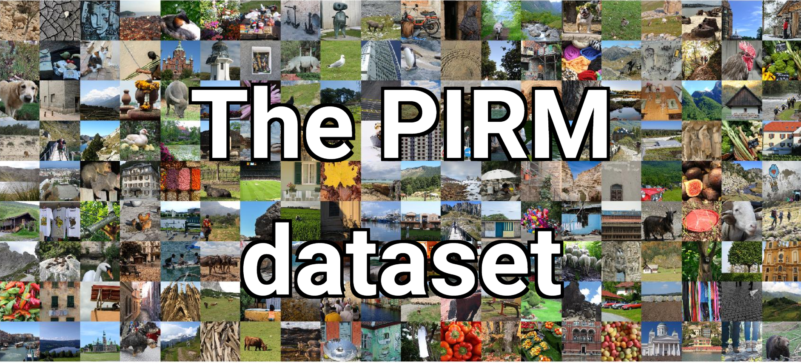

# PIRM 数据集介绍

1. PIRM 数据集 PIRM数据集由200幅图像组成，分为两组进行验证和测试。这些图像涵盖各种内容，包括人、物体、环境、 植物、自然景观等。图像大小不同，分辨率通常为~300K像素。 该数据集首次用于评估2018年PIRM感知
   超分辨率挑战赛中超分辨率算法的感知质量，并与ECCV 2018联合使用。 该数据集还包括所有图像的4倍 下采样版本，即分发给挑战参与者的图像。


<div style="text-align: center;">PIRM预览</div>

2. 使用方法

```
    """ 用法示例 """

    # 填写数据集的上级目录
    root = r'E:\MindsporeVision\dataset\PIRM'

    # 实例化，注意图片为HWC、BGR格式，所以训练时候要转化为CHW、RGB格式
    dataset = PIRM(root, is_training=True, scale=2, name="Self-Val")

    # 设置一些参数，如shuffle、num_parallel_workers等等
    dataset = ds.GeneratorDataset(dataset,
                                  column_names=["image", "label"],
                                  num_parallel_workers=1,
                                  num_samples=None,
                                  shuffle=False)

    # 做一些数据增强，如果不需要增强可以把这段代码注释掉
    # 首先把数据集设置为uint8，因为map只支持uint8
    dataset = dataset.map(operations=ctrans.TypeCast(mstype.uint8), input_columns="image")
    dataset = dataset.map(operations=ctrans.TypeCast(mstype.uint8), input_columns="label")

    # # 此处填写所需要的数据增强算子
    # transform = [cvision.Resize(448),
    #              cvision.RandomCrop(448)]
    # dataset = dataset.map(operations=transform, input_columns="image")
    # dataset = dataset.map(operations=transform, input_columns="label")

    # 显示5张图片
    for index, data in enumerate(dataset.create_dict_iterator(output_numpy=True)):
        if index >= 5:
            break
        print(data["image"].shape, data["label"].shape)
        plt.subplot(2, 5, index + 1)
        plt.imshow(data["image"].squeeze())
        plt.title("data")

        plt.subplot(2, 5, index + 1 + 5)
        plt.imshow(data["label"].squeeze())
        plt.title("label")
    plt.show()

```

3. 数据集目录结构（如果目录结构和下面不一样，脚本将无法正确运行）

```
PIRM/
    PIRM_Self-Val_set/
        HR/
            1.png
            2.png
            3.png
            ...
        LR/
            1.png
            2.png
            3.png
            ...
    PIRM_Test_set/
        LR/
            201.png
            202.png
            203.png
            ...
    PIRM_Val_set/
        LR/
            101.png
            102.png
            103.png
            ...
```

4. 关于该数据集的详细信息，请参考：https://pirm.github.io/

